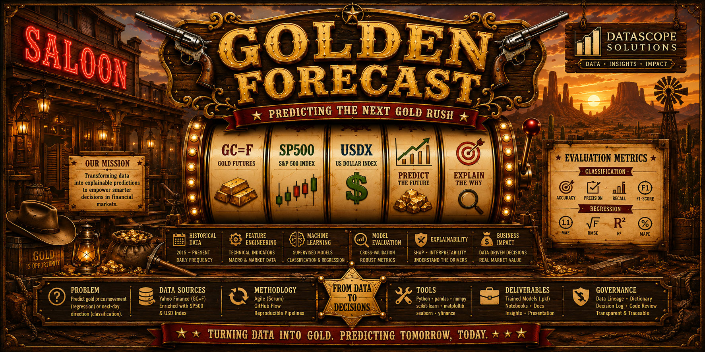

<p align="center">
  
</p>

<p align="center">
  
  
  
  
  
  
  
  
  
</p>

# Golden Forecast — DataScope Solutions

## Contexto

Somos **DataScope Solutions**, consultora internacional de análisis de datos. Este proyecto aplica Machine Learning supervisado sobre datos históricos del oro para generar predicciones explicables.

## Equipo

| Rol | Nombre |
|-----|--------|
| Product Owner | María |
| Scrum Master | Juan |
| Development Team | José, Gema, Joel |

## Problema de negocio

Predecir el comportamiento del precio del oro (GC=F) usando datos históricos y macroeconómicos (DXY, VIX, TNX). Abordamos el problema desde dos enfoques:

- **Regresión**: predecir el precio de cierre (valor numérico continuo)
- **Clasificación**: predecir si el precio subirá o bajará al día siguiente (binario) y clasificación multiclase (fuerte/subida/estable/bajada)

## Dataset

Datos diarios de **GC=F** (Gold Futures), **DXY** (US Dollar Index), **VIX** (Volatility Index) y **TNX** (10Y Treasury Yield) vía Yahoo Finance desde 2015 hasta la actualidad.

## Stack tecnológico

| Tecnología | Uso |
|------------|-----|
| Python 3.10+ | Lenguaje principal |
| pandas, numpy | Manipulación y análisis de datos |
| scikit-learn | Modelos de clasificación y regresión |
| XGBoost | Gradient boosting |
| Plotly + Dash | Dashboard interactivo |
| Flask | Servidor web del dashboard |
| yfinance | Descarga de datos financieros |
| Matplotlib / Seaborn | Visualización en notebooks |

## Dashboard

El dashboard estilo **tragaperras del lejano oeste** está disponible en `http://localhost:8050` con las siguientes secciones:

- 📈 **Precio**: gráfico de precio del oro, RSI, MACD y volatilidad
- 📊 **Macro**: correlaciones con DXY, VIX, TNX
- 🤖 **Modelos**: comparativa de precisión de 4 modelos
- 💰 **Backtest**: rendimiento de la estrategia vs Buy & Hold
- 🎮 **Simulación**: simulador de trading con datos históricos

Para ejecutarlo:
```bash
python src/dashboard/app.py
```

## Estructura del repositorio

```
golden-forecast/
├── data/raw/         # Datos crudos (CSV gold-macro-data.csv)
├── notebooks/        # Notebooks del pipeline completo
├── src/
│   ├── dashboard/    # Dashboard Dash + assets (CSS, audio, banner)
│   └── extract/      # Script de extracción de datos
├── docs/             # Documentación, decisiones, PR template
├── README.md
├── ROADMAP.md
└── requirements.txt
```

## Cómo ejecutar

1. Clonar el repositorio
2. `pip install -r requirements.txt`
3. `python src/dashboard/app.py`
4. Abrir `http://localhost:8050`

## Licencia

Proyecto académico sin fines comerciales.
